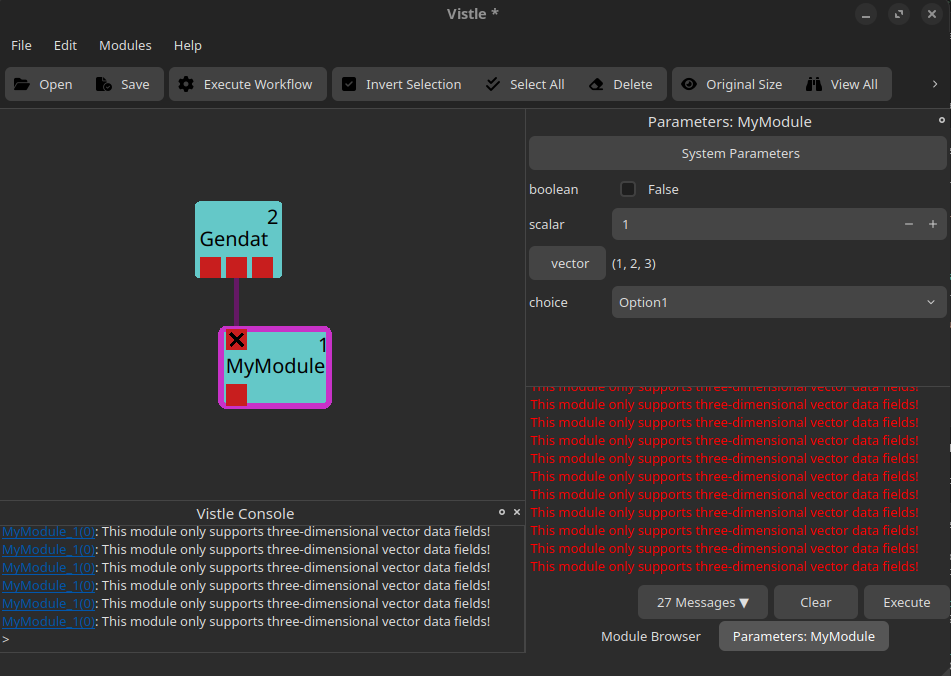
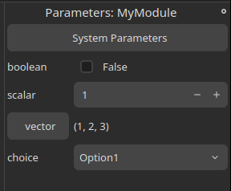
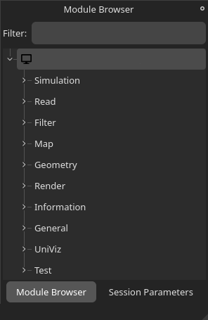

# The Basics

Vistle is designed to be easily extensible through its modular structure. This tutorial will show you how to write your own Vistle module and how to incorporate it into the software, so you can use it right away.

## Overview
- [The Module Class](#the-module-class)
- [Creating Input and Output Ports](#creating-input-and-output-ports)
- [Creating Module Parameters](#creating-module-parameters)
- [Sample Module Code](#sample-module-code)
- [How to Add a Module to Vistle](#how-to-add-a-module-to-vistle)

## The Module Class

The most common Vistle modules are the compute modules. They receive data from other modules through their input port(s), run computations on the data, and return the result(s) through their output port(s).

The following example shows the minimum code necessary to develop a Vistle module. It will create a module named **MyModule**. 

```cpp
#ifndef MYMODULE_H
#define MYMODULE_H

#include <vistle/module/module.h>

// this is a test module for the developer guide
class MyModule: public vistle::Module {
public:
    MyModule(const std::string &name, int moduleID, mpi::communicator comm);
    ~MyModule();

private:
    bool compute(const std::shared_ptr<vistle::BlockTask> &task) const override;
};

#endif // MYMODULE_H
```

To create a new Vistle module, create a class which inherits from the `vistle::Module` class. The name of that class should match the module's name, so that is can be easily discovered. However, the name that is visible in the GUI later on, is determined by the `CMakeLists.txt` scripts(see below).
The input and output ports as well as the parameters of the module are defined in the class's constructor. The computations done by the module are defined in the `compute` method. This method is called whenever the Vistle pipeline is executed or you double-click on the module.

### The Main Function

It's important to add the following line to the top of your module's source file. It automatically creates the main function of the module integrating it into Vistle correctly.
```cpp
MODULE_MAIN(MyModule)
```

## Creating Input and Output Ports
### Defining Ports
 The input and output ports are created by calling the `createInputPort` and `createOutputPort` functions in the module's constructor. Two strings, the name of the port (which can be used to reference it in the code later on) and a short description, must be passed to the function, as shown in the following example:
```cpp
MyModule::MyModule(const std::string &name, int moduleID, mpi::communicator comm): Module(name, moduleID, comm)
{
    // define the module's ports
    createInputPort("data_in", "input grid with mapped data");
    createOutputPort("data_out", "output grid with mapped data");
}
```

This code snippet adds an input and an output port to the module in the GUI:


Hovering over either port will show the port's name and description.

### Receiving Data through Input Ports
The following code snippet is an example of how to work with the data provided by the input port in the `compute` function.

```cpp
bool MyModule::compute(const std::shared_ptr<vistle::BlockTask> &task) const
{
    // check data provided by input port
    auto input = task->expect<Vec<Scalar, 3>>("data_in");
    if (!input) {
        sendError("This module only supports three-dimensional vector data fields!");
        return true;
    }

    auto container = splitContainerObject(input);
    auto grid = container.geometry;
    if (!grid) {
        sendError("Found no grid at the input port!");
        return true;
    }
    return true;
}
```
The code checks if the data field attached to the input grid is a three-dimensional vector and if the input grid is valid. If not, an error message is printed using the `sendError` method. The error message will be shown in the Vistle console as well as in the parameter window:



### Adding Data to Output Ports

The following code snippet shows how to add a uniform grid and a scalar data field to the module's output port:
```cpp
bool MyModule::compute(const std::shared_ptr<vistle::BlockTask> &task) const
{
    // create an output grid
    size_t gridDim = 2;
    UniformGrid::ptr outputGrid(new UniformGrid(gridDim, gridDim, gridDim));

    for (unsigned i = 0; i < 3; i++) {
        outputGrid->min()[i] = 0;
        outputGrid->max()[i] = 1;
    }

    updateMeta(outputGrid);

    // create a scalar data field which maps a value to each vertex of the grid
    auto fieldSize = (gridDim + 1) * (gridDim + 1) * (gridDim + 1);
    Vec<Scalar, 1>::ptr outputData(new Vec<Scalar, 1>(fieldSize));
    for (unsigned i = 0; i < fieldSize; i++)
        outputData->x()[i] = 0.5 * i;

    outputData->setGrid(outputGrid);
    outputData->setMapping(DataBase::Vertex);
    outputData->addAttribute("_species", "outputData");
    updateMeta(outputData);

    // add mapped data to the output port
    task->addObject("data_out", outputData);

    return true;
}
```

The code creates a uniform grid of dimension 2x2x2 which spans from the point (0|0|0) to the point (1|1|1) as well as a scalar data field which provides one float value for each of the vertices in the grid.

`updateMeta` is called both for the grid and the data field and ensures that the metadata of the two objects is set up correctly for further use in Vistle.

The grid is attached to the data field with the `setGrid` method which allows us to add both data and grid to a single output port. The `setMapping` method is used to specify whether the data field is mapped to each vertex in the grid (`DataBase::Vertex`) or to each grid cell (`DataBase::Element`). The `addAttribute` method is used to give the data field a name which can be used by other modules. It is, e.g., displayed in the color map created by the [Color](../../module/map/Color/Color.md) module.

Finally, the data field, which now also includes the grid it is mapped onto, is added to the output port created and named in the constructor with `addObject`. 

## Creating Module Parameters
### Defining Module Parameters
Module parameters can be defined by using the `addIntParameter`, `addFloatParameter`, `addStringParameter`, `addVectorParameter`, `addIntVectorParameter` or `addStringVectorParameter` functions in the module's constructor. All of these functions expect a string with the parameter's name, a string with the parameter's description and a default value. Some functions expect additional parameters or have overloaded function definitions.

In the following example code, we show how to add the most commonly used module parameters to **MyModule**. Note that class members for each of the module's parameters have been added to **MyModule**'s header file beforehand (see [header file here](#sample-module-code)).

```cpp
DEFINE_ENUM_WITH_STRING_CONVERSIONS(Option, (Option0)(Option1)(Option2))

MyModule::MyModule(const std::string &name, int moduleID, mpi::communicator comm): Module(name, moduleID, comm)
{
    // define the module's parameters
    m_boolean = addIntParameter("boolean", "a boolean parameter", false, Parameter::Boolean);

    m_scalar = addFloatParameter("scalar", "a float parameter", 1.0);
    setParameterRange(m_scalar, 0.0, 10.0);

    m_vector = addVectorParameter("vector", "a vector parameter", ParamVector(1.0, 2.0, 3.0));

    m_choice = addIntParameter("choice", "choose one of the options", Option1, Parameter::Choice);
    V_ENUM_SET_CHOICES(m_choice, Option);
}
```
This code snippet created the following parameters which can be modified in the GUI's parameter window:



The first parameter is a boolean parameter with the default value false. Passing `Parameter::Boolean` to the `addIntParameters` function (as shown in the example), will create a checkbox that the user can toggle in the GUI.

The second parameter is a float value which the user can set in the parameter window. If desired, a minimum and maximum value can be defined for any arithmetic parameter using the `setParameterRange` method. The `scalar` parameter in this example only allows float values between 0 and 10.

The third parameter is a vector parameter which is created similarly to the scalar parameters. The user can define each component separately.

Finally, the fourth parameter is a choice parameter which creates a drop-down menu in the GUI which allows the user to set one of the available options. To create a choice parameter:
1. Pass `Parameter::Choice` to the `addIntParameters` function
2. Create an enum including all possible options using the `DEFINE_ENUM_WITH_STRING_CONVERSIONS` macro. Note that the names you define here will be displayed in the drop-down menu later on.
3. Add the enum to the choice parameter with the `V_ENUM_SET_CHOICES` function.

### Working with Module Parameters

The Module class provides a `changeParameter` method which is called everytime a module parameter is changed. The value of a module parameter can be read with the `getValue()` function.

The following code snippet prints out which parameter has been changed to which value whenever one of **MyModule**'s four parameters is changed:

```cpp
bool MyModule::changeParameter(const vistle::Parameter *param)
{
    if (param == m_boolean) {
        sendInfo("Changed parameter %s to %d", m_boolean->getName().c_str(), m_boolean->getValue());
    } else if (param == m_scalar) {
        sendInfo("Changed parameter %s to %f", m_scalar->getName().c_str(), m_scalar->getValue());

    } else if (param == m_vector) {
        auto vector = m_vector->getValue();
        sendInfo("Changed parameter %s to (%f, %f, %f)", m_vector->getName().c_str(), vector[0], vector[1], vector[2]);

    } else if (param == m_choice) {
        sendInfo("Changed parameter %s to Option%d", m_choice->getName().c_str(), (Option)m_choice->getValue());
    }

    return true;
}
```  

## Sample Module Code

For your convenience, the complete header and source file for **MyModule** are provided here:
<details>
<summary> Click on the arrow on the left to view the complete MyModule header file. </summary>

`module/test/MyModule/MyModule.h`:

```cpp
#ifndef MYMODULE_H
#define MYMODULE_H

#include <vistle/module/module.h>

// this is a test module for the developer guide
class MyModule: public vistle::Module {
public:
    MyModule(const std::string &name, int moduleID, mpi::communicator comm);
    ~MyModule();

private:
    bool compute(const std::shared_ptr<vistle::BlockTask> &task) const override;
    bool changeParameter(const vistle::Parameter *param) override;

    vistle::IntParameter *m_boolean;
    vistle::FloatParameter *m_scalar;
    vistle::VectorParameter *m_vector;
    vistle::IntParameter *m_choice;
};

#endif // MYMODULE_H
```
</details>

<details>
<summary> Click on the arrow on the left to view the complete MyModule source file.</summary>

`module/test/MyModule/MyModule.cpp`

```cpp
#include <vistle/alg/objalg.h>
#include <vistle/core/uniformgrid.h>

#include "MyModule.h"

MODULE_MAIN(MyModule)

using namespace vistle;

DEFINE_ENUM_WITH_STRING_CONVERSIONS(Option, (Option0)(Option1)(Option2))

MyModule::MyModule(const std::string &name, int moduleID, mpi::communicator comm): Module(name, moduleID, comm)
{
    // define the module's ports
    createInputPort("data_in", "input grid with mapped data");
    createOutputPort("data_out", "output grid with mapped data");

    // define the module's parameters
    m_boolean = addIntParameter("boolean", "a boolean parameter", false, Parameter::Boolean);

    m_scalar = addFloatParameter("scalar", "a float parameter", 1.0);
    setParameterRange(m_scalar, 0.0, 10.0);

    m_vector = addVectorParameter("vector", "a vector parameter", ParamVector(1.0, 2.0, 3.0));

    m_choice = addIntParameter("choice", "choose one of the options", Option1, Parameter::Choice);
    V_ENUM_SET_CHOICES(m_choice, Option);
}

MyModule::~MyModule()
{}

bool MyModule::compute(const std::shared_ptr<vistle::BlockTask> &task) const
{
    // check data provided by input port
    auto input = task->expect<Vec<Scalar, 3>>("data_in");
    if (!input) {
        sendError("This module only supports three-dimensional vector data fields!");
        return true;
    }

    auto container = splitContainerObject(input);
    auto grid = container.geometry;
    if (!grid) {
        sendError("Found no grid at the input port!");
        return true;
    }

    // create an output grid
    size_t gridDim = 2;
    UniformGrid::ptr outputGrid(new UniformGrid(gridDim, gridDim, gridDim));

    for (unsigned i = 0; i < 3; i++) {
        outputGrid->min()[i] = 0;
        outputGrid->max()[i] = 1;
    }

    updateMeta(outputGrid);

    // create a scalar data field which maps a value to each vertex of the grid
    auto fieldSize = (gridDim + 1) * (gridDim + 1) * (gridDim + 1);
    Vec<Scalar, 1>::ptr outputData(new Vec<Scalar, 1>(fieldSize));
    for (unsigned i = 0; i < fieldSize; i++)
        outputData->x()[i] = 0.5 * i;

    outputData->setGrid(outputGrid);
    outputData->setMapping(DataBase::Vertex);
    outputData->addAttribute("_species", "outputData");
    updateMeta(outputData);

    // add mapped data to the output port
    task->addObject("data_out", outputData);

    return true;
}

bool MyModule::changeParameter(const vistle::Parameter *param)
{
    if (param == m_boolean) {
        sendInfo("Changed parameter %s to %d", m_boolean->getName().c_str(), m_boolean->getValue());
    } else if (param == m_scalar) {
        sendInfo("Changed parameter %s to %f", m_scalar->getName().c_str(), m_scalar->getValue());

    } else if (param == m_vector) {
        auto vector = m_vector->getValue();
        sendInfo("Changed parameter %s to (%f, %f, %f)", m_vector->getName().c_str(), vector[0], vector[1], vector[2]);

    } else if (param == m_choice) {
        sendInfo("Changed parameter %s to Option%d", m_choice->getName().c_str(), (Option)m_choice->getValue());
    }

    return true;
}

```
</details>

## How to Add a Module to Vistle

The code for all Vistle modules can be found in the `module` folder in Vistle's root directory. The `module` folder is divided into subdirectories which represent different stages of the visualization pipeline. Note that the names of these subfolders correspond to the categories shown in Vistle's module browser:



Choose the category which fits your module best. The categories are explained in the [Workflow](../../intro/workflow/workflow.md) article.

As it does not have any concrete functionality, **MyModule** will be placed into the **Test** category. By convention, all code files for a module are placed inside a folder named after the module. So, for **MyModule** a folder called `MyModule` must be created inside `module/test` and the source and header files we have created earlier must be moved inside.

To tell the system to compile our code, we have to create a `CMakeLists.txt` file which calls the `add_module` target. Pass the module's name, a short description as well as all necessary header and source files to the `add_module` call. Note that the short description will be shown whenever you hover over the **MyModule** module in the Vistle GUI. The first argument is the name of the module as it will be known to Vistle.
By convention, the main source file is named accordingly.

`module/test/MyModule/CMakeLists.txt`
```cmake
add_module(MyModule "Test module" MyModule.h MyModule.cpp)
```

As a last step, add the subdirectory you just created to the category's `CMakeLists.txt` file which is located in the parent directory of your module's `CMakeLists.txt` file:


`module/test/CMakeLists.txt`

```cmake
# modules mainly suitable for testing and developing
set(VISTLE_MODULE_CATEGORY "Test")

add_subdirectory(ClipVtkm)
# ...
add_subdirectory(MpiInfo)
add_subdirectory(MyModule) # add this line to include our test module in vistle
add_subdirectory(ObjectStatistics)
# ...

```

Now, when you compile Vistle, your module will be built. It will be added to the module browser on Vistle's next invocation, allowing you to use it. 
