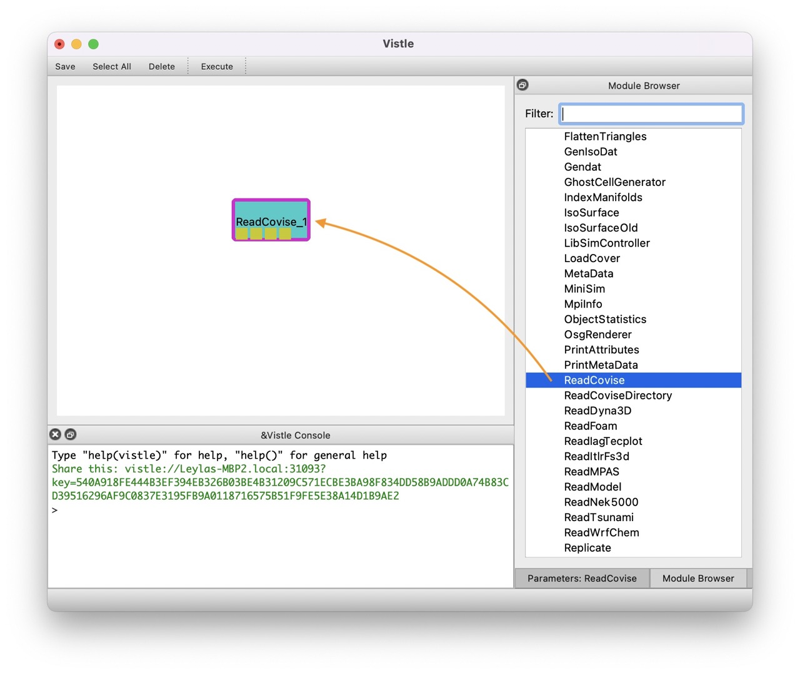
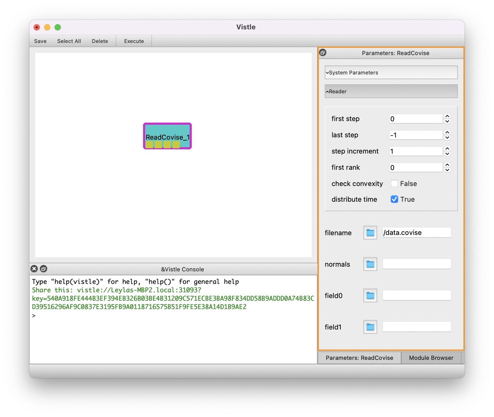
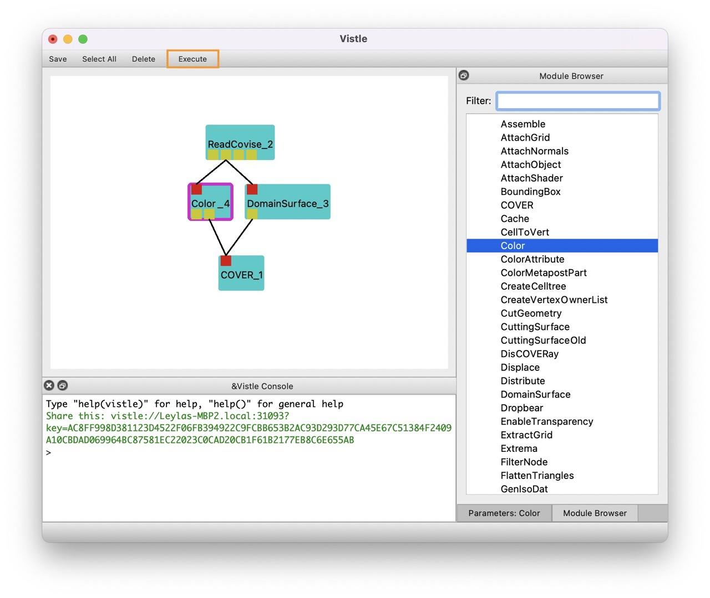
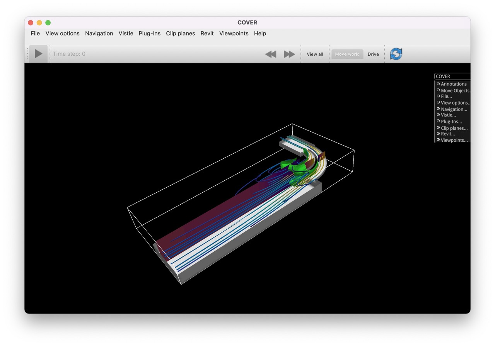

# Quickstart

This chapter shows the basic steps to get started using Vistle. For more detailed descriptions, consult the following chapters.

To start Vistle, open a terminal, navigate to the Vistle installation directory and open the [Vistle GUI](../intro/gui/gui.md) by typing

    > vistle

## Adding Modules
Modules represent processing steps and are used to set up a workflow. To add a new module to a workflow, go to the Module Browser on the right-hand side of the [GUI](../intro/gui/gui.md) and scroll through the list or filter for modules by name. Drag and drop a module from the list to the workflow area (the empty upper-left area) to use it. If started successfully, a module icon will appear. Modules can be deleted using the *Delete* option in the right-click menu of the module icon.

### Commonly Used Modules
Some commonly employed modules are listed in the following. A complete list of modules can be found in the [Module Guide](../module/index.rst). 

* I/O: all modules starting with *Read*...
* Processing *scalar* data:
    [DomainSurface](../module/map/DomainSurface/DomainSurface.md), [IsoSurface](../module/map/IsoSurface/IsoSurface.md), [CuttingSurface](../module/map/CuttingSurface/CuttingSurface.md)
* Processing *vector* data:
    [Tracer](../module/map/Tracer/Tracer.md), [VectorField](../module/map/VectorField/VectorField.md)
* Colorization:
    [Color](../module/map/Color/Color.md)
* Rendering: 
    [COVER](../module/render/COVER/COVER.md)
* Other useful tools: [BoundingBox](../module/map/BoundingBox/BoundingBox.md), [ObjectStatistics](../module/test/ObjectStatistics/ObjectStatistics.md)
## Configuring Modules
By clicking on a module icon in the workflow area, its parameters will appear on the right-hand side replacing the Module Browser frame.
Within these, modules can be configured as by specifying the path to data files, selecting variables to be read or setting isovalues.

## Linking Modules
Modules have input and/or output ports which allow to pass data from one module to another.
By hovering over the ports, information can be retrieved. Ports can be interlinked by clicking and dragging the mouse from one port to the other. Double-click on the connection will remove it.

## Executing a Workflow
A workflow can be executed by clicking on *Execute* in the menu bar, or double-click on a module to execute this an all subsequent modules.

## Rendering and Interaction
To render the results, a workflow is typically finalized with a [COVER](../module/render/COVER/COVER.md) module. The outcome will be rendered in the COVER window. Navigation is possible using the mouse.

